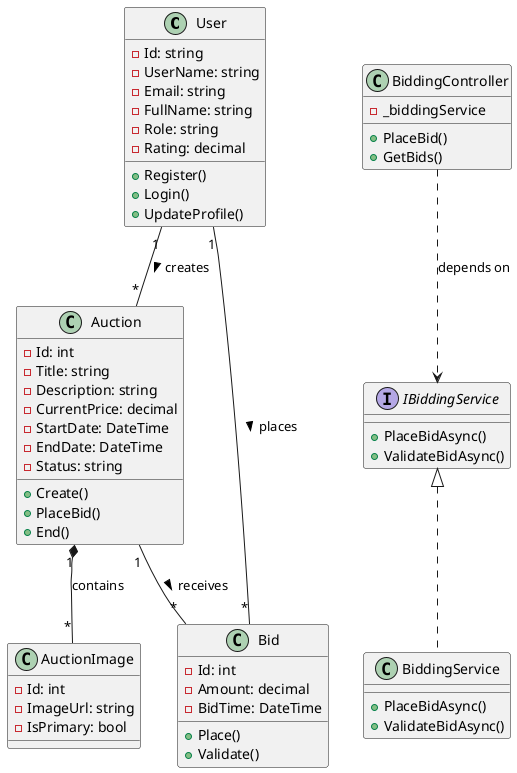

# Architectural Diagrams Specifications

This document provides detailed specifications for creating the three mandatory architectural diagrams for the project report.

---

## 📐 Diagram 1: Class Diagram (MANDATORY)

### Purpose
Show all major classes in the system with their attributes, methods, and relationships.

### Required Elements

#### 1. User Management Classes
```
┌─────────────────────────────┐
│          User               │
├─────────────────────────────┤
│ - Id: string                │
│ - UserName: string          │
│ - Email: string             │
│ - PasswordHash: string      │
│ - FullName: string          │
│ - PhoneNumber: string       │
│ - Address: string           │
│ - Role: string              │
│ - Rating: decimal           │
│ - IsApproved: bool          │
│ - IsSuspended: bool         │
│ - CreatedDate: DateTime     │
│ - ProfileImageUrl: string   │
├─────────────────────────────┤
│ + Register()                │
│ + Login()                   │
│ + UpdateProfile()           │
│ + ChangePassword()          │
└─────────────────────────────┘
```

#### 2. Auction Core Classes
```
┌─────────────────────────────┐
│         Auction             │
├─────────────────────────────┤
│ - Id: int                   │
│ - Title: string             │
│ - Description: string       │
│ - Category: string          │
│ - Condition: string         │
│ - StartingPrice: decimal    │
│ - CurrentPrice: decimal     │
│ - BuyNowPrice: decimal      │
│ - ReservePrice: decimal     │
│ - BidIncrement: decimal     │
│ - StartDate: DateTime       │
│ - EndDate: DateTime         │
│ - Status: string            │
│ - SellerId: string          │
│ - WinnerId: string          │
│ - ViewCount: int            │
│ - BidCount: int             │
│ - IsFeatured: bool          │
│ - IsActive: bool            │
├─────────────────────────────┤
│ + Create()                  │
│ + Update()                  │
│ + Delete()                  │
│ + PlaceBid()                │
│ + End()                     │
│ + Cancel()                  │
└─────────────────────────────┘
        │
        │ 1
        │ has
        │
        ▼ *
┌─────────────────────────────┐
│      AuctionImage           │
├─────────────────────────────┤
│ - Id: int                   │
│ - AuctionId: int            │
│ - ImageUrl: string          │
│ - IsPrimary: bool           │
│ - DisplayOrder: int         │
│ - UploadedDate: DateTime    │
├─────────────────────────────┤
│ + Upload()                  │
│ + Delete()                  │
│ + SetPrimary()              │
└─────────────────────────────┘
```

#### 3. Bidding Classes
```
┌─────────────────────────────┐
│           Bid               │
├─────────────────────────────┤
│ - Id: int                   │
│ - AuctionId: int            │
│ - UserId: string            │
│ - Amount: decimal           │
│ - BidTime: DateTime         │
│ - IsAutomaticBid: bool      │
│ - MaxAmount: decimal        │
│ - IPAddress: string         │
│ - IsWinning: bool           │
├─────────────────────────────┤
│ + Place()                   │
│ + Validate()                │
│ + GetHistory()              │
└─────────────────────────────┘
```

#### 4. Service Layer (Interfaces and Implementations)
```
┌─────────────────────────────┐
│      <<interface>>          │
│       IAuthService          │
├─────────────────────────────┤
│ + RegisterAsync()           │
│ + LoginAsync()              │
│ + GenerateJwtToken()        │
│ + ValidateToken()           │
└─────────────────────────────┘
        △
        │ implements
        │
┌─────────────────────────────┐
│       AuthService           │
├─────────────────────────────┤
│ - _userManager              │
│ - _signInManager            │
│ - _jwtSecret                │
├─────────────────────────────┤
│ + RegisterAsync()           │
│ + LoginAsync()              │
│ + GenerateJwtToken()        │
│ + ValidateToken()           │
└─────────────────────────────┘
```

#### 5. Controller Layer
```
┌─────────────────────────────┐
│    <<ApiController>>        │
│    BiddingController        │
├─────────────────────────────┤
│ - _biddingService           │
│ - _hubContext               │
├─────────────────────────────┤
│ + PlaceBid()                │
│ + GetBids()                 │
│ + GetHighestBid()           │
│ + ValidateBid()             │
│ + GetNextMinimumBid()       │
└─────────────────────────────┘
        │ depends on
        ▼
┌─────────────────────────────┐
│      <<interface>>          │
│     IBiddingService         │
├─────────────────────────────┤
│ + PlaceBidAsync()           │
│ + ValidateBidAsync()        │
│ + GetBidHistoryAsync()      │
│ + CalculateNextMinBid()     │
└─────────────────────────────┘
```

#### 6. SignalR Hub
```
┌─────────────────────────────┐
│      <<Hub>>                │
│       BiddingHub            │
├─────────────────────────────┤
│ + JoinAuction()             │
│ + LeaveAuction()            │
│ + SendBidUpdate()           │
│ + NotifyCountdown()         │
│ + NotifyAuctionEnd()        │
└─────────────────────────────┘
```

#### 7. Data Context
```
┌─────────────────────────────┐
│  ApplicationDbContext       │
├─────────────────────────────┤
│ + Auctions: DbSet<Auction>  │
│ + Bids: DbSet<Bid>          │
│ + Users: DbSet<User>        │
│ + Transactions: DbSet<>     │
│ + WatchlistItems: DbSet<>   │
├─────────────────────────────┤
│ + OnModelCreating()         │
│ + SaveChangesAsync()        │
└─────────────────────────────┘
```

### Relationships to Show
1. **Inheritance:** User inherits from IdentityUser
2. **Composition:** Auction HAS AuctionImages (1 to many)
3. **Association:** User places Bids (1 to many)
4. **Association:** Auction receives Bids (1 to many)
5. **Association:** User creates Auctions as Seller (1 to many)
6. **Association:** User wins Auctions (1 to many, optional)
7. **Dependency:** Controllers depend on Services
8. **Dependency:** Services depend on DbContext
9. **Implementation:** Service classes implement Interfaces
10. **Aggregation:** User has WatchlistItems

### Notation Guidelines
- **Solid line:** Strong relationship (composition)
- **Dashed line:** Weak relationship (dependency)
- **Triangle arrow:** Inheritance/Implementation
- **Diamond:** Aggregation/Composition
- **Multiplicity:** 1, *, 0..1, 1..*

### Tools Recommendation
- **PlantUML** - Code-based diagram generation
- **Visual Paradigm** - Professional UML tool
- **Draw.io** - Free online tool
- **StarUML** - Desktop application

### PlantUML Sample Code


---

## 🏗️ Diagram 2: System Architecture Diagram

### Purpose
Show the high-level architecture of the entire system including all tiers, components, and communication protocols.

### Required Components

#### Three-Tier Architecture

```
┌─────────────────────────────────────────────────────────────────┐
│                    PRESENTATION TIER (Frontend)                  │
│                          Port: 3000                              │
├─────────────────────────────────────────────────────────────────┤
│                                                                   │
│  ┌─────────────┐  ┌──────────────┐  ┌─────────────┐            │
│  │   Pages     │  │  Components  │  │   Services  │            │
│  ├─────────────┤  ├──────────────┤  ├─────────────┤            │
│  │ - Home      │  │ - Header     │  │ - authSvc   │            │
│  │ - Login     │  │ - Footer     │  │ - auctionSvc│            │
│  │ - Register  │  │ - Bidding UI │  │ - biddingSvc│            │
│  │ - Auction   │  │ - Cards      │  │ - adminSvc  │            │
│  │ - Profile   │  │ - Forms      │  │ - signalR   │            │
│  └─────────────┘  └──────────────┘  └─────────────┘            │
│                                                                   │
│  React 19.1 | React Router | Axios | SignalR Client | Bootstrap │
└────────────────────┬──────────────────────────────────┬─────────┘
                     │                                   │
         HTTP/HTTPS (REST API)              WebSocket (SignalR)
         Port: 5103                         Port: 5103
                     │                                   │
┌────────────────────▼───────────────────────────────────▼─────────┐
│                   BUSINESS LOGIC TIER (Backend)                   │
│                  ASP.NET Core 9.0 - Port: 5103                    │
├─────────────────────────────────────────────────────────────────┤
│                                                                   │
│  ┌─────────────────┐  ┌──────────────┐  ┌──────────────┐       │
│  │  Controllers    │  │   Services   │  │     Hubs     │       │
│  ├─────────────────┤  ├──────────────┤  ├──────────────┤       │
│  │ - Auth          │  │ - Auth       │  │ - Bidding    │       │
│  │ - Auctions      │  │ - Auction    │  │              │       │
│  │ - Bidding       │  │ - Bidding    │  └──────────────┘       │
│  │ - Admin         │  │ - Admin      │                          │
│  │ - Reports       │  │ - Reporting  │                          │
│  │ - Social        │  │ - Social     │                          │
│  └─────────────────┘  └──────────────┘                          │
│                                                                   │
│  ┌──────────────────────────────────────────────────────┐       │
│  │            Middleware Stack                          │       │
│  ├──────────────────────────────────────────────────────┤       │
│  │ • JWT Authentication                                 │       │
│  │ • CORS Policy                                        │       │
│  │ • Exception Handling                                 │       │
│  │ • Request Logging                                    │       │
│  │ • Rate Limiting                                      │       │
│  └──────────────────────────────────────────────────────┘       │
│                                                                   │
│  ASP.NET Core Identity | SignalR | Entity Framework Core         │
└────────────────────┬─────────────────────────────────────────────┘
                     │
         Entity Framework Core ORM
         MySQL Connector
                     │
┌────────────────────▼─────────────────────────────────────────────┐
│                     DATA ACCESS TIER (Database)                   │
│                        MySQL 8.0+ Server                          │
├─────────────────────────────────────────────────────────────────┤
│                                                                   │
│  ┌──────────────┐  ┌──────────────┐  ┌──────────────┐          │
│  │ User Tables  │  │Auction Tables│  │System Tables │          │
│  ├──────────────┤  ├──────────────┤  ├──────────────┤          │
│  │ AspNetUsers  │  │ Auctions     │  │ AuditLogs    │          │
│  │ AspNetRoles  │  │ AuctionImage │  │ SystemSet... │          │
│  │ UserReviews  │  │ Bids         │  │ AdminActiv..│          │
│  │ Watchlist... │  │ Categories   │  │ SocialShares│          │
│  │ Transaction  │  │ AuctionViews │  │              │          │
│  └──────────────┘  └──────────────┘  └──────────────┘          │
│                                                                   │
│  Indexes | Foreign Keys | Constraints | Stored Procedures        │
└─────────────────────────────────────────────────────────────────┘

┌─────────────────────────────────────────────────────────────────┐
│                      EXTERNAL SERVICES                            │
├─────────────────────────────────────────────────────────────────┤
│  📱 Social Media APIs  │  📧 Email Service  │  💳 Payment Gateway│
│  - Facebook Share      │  - SMTP Server     │  - Stripe/PayPal  │
│  - Twitter Share       │  - SendGrid        │  (Future)         │
│  - WhatsApp Share      │                    │                   │
└─────────────────────────────────────────────────────────────────┘
```

### Communication Protocols
- **HTTP/HTTPS:** RESTful API calls (GET, POST, PUT, DELETE)
- **WebSocket:** Real-time bidding updates via SignalR
- **TCP/IP:** Database connections
- **OAuth 2.0:** Social media authentication (future)

### Data Flow Example (Place Bid)
```
User clicks "Place Bid" button
    ↓
React Component validates input
    ↓
Axios sends POST request with JWT token
    ↓
ASP.NET Core Middleware validates JWT
    ↓
BiddingController receives request
    ↓
BiddingService processes bid logic
    ↓
ApplicationDbContext saves to database
    ↓
BiddingHub broadcasts to all clients via WebSocket
    ↓
React components receive update and re-render
```

---

## 🗄️ Diagram 3: Database ER Diagram

### Purpose
Show all database tables, their attributes, primary keys, foreign keys, and relationships.

### Core Tables Structure

#### 1. User Management Tables
```
┌─────────────────────────────┐
│      AspNetUsers (PK: Id)   │
├─────────────────────────────┤
│ PK  Id                      │
│     UserName                │
│ UK  Email                   │
│     PasswordHash            │
│     FullName                │
│     PhoneNumber             │
│     Address                 │
│     City                    │
│     Country                 │
│     PostalCode              │
│     Role                    │
│     Rating                  │
│     IsApproved              │
│     IsSuspended             │
│     CreatedDate             │
│     LastLoginDate           │
│     ProfileImageUrl         │
└─────────────────────────────┘
```

#### 2. Auction Tables
```
┌─────────────────────────────┐
│     Auctions (PK: Id)       │
├─────────────────────────────┤
│ PK  Id                      │
│     Title                   │
│     Description             │
│     Category                │
│     Condition               │
│     StartingPrice           │
│     CurrentPrice            │
│     BuyNowPrice             │
│     ReservePrice            │
│     BidIncrement            │
│     StartDate               │
│     EndDate                 │
│     Status                  │
│ FK  SellerId → Users.Id     │
│ FK  WinnerId → Users.Id     │
│     ViewCount               │
│     BidCount                │
│     IsFeatured              │
│     IsActive                │
└─────────────────────────────┘
        │
        │ 1:N
        ▼
┌─────────────────────────────┐
│   AuctionImages (PK: Id)    │
├─────────────────────────────┤
│ PK  Id                      │
│ FK  AuctionId → Auctions.Id │
│     ImageUrl                │
│     IsPrimary               │
│     DisplayOrder            │
│     UploadedDate            │
└─────────────────────────────┘
```

#### 3. Bidding Tables
```
┌─────────────────────────────┐
│       Bids (PK: Id)         │
├─────────────────────────────┤
│ PK  Id                      │
│ FK  AuctionId → Auctions.Id │
│ FK  UserId → Users.Id       │
│     Amount                  │
│     BidTime                 │
│     IsAutomaticBid          │
│     MaxAmount               │
│     IPAddress               │
│     IsWinning               │
└─────────────────────────────┘
```

#### 4. Commerce Tables
```
┌─────────────────────────────┐
│   Transactions (PK: Id)     │
├─────────────────────────────┤
│ PK  Id                      │
│ FK  AuctionId → Auctions.Id │
│ FK  BuyerId → Users.Id      │
│ FK  SellerId → Users.Id     │
│     Amount                  │
│     TransactionDate         │
│     Status                  │
│     PaymentMethod           │
└─────────────────────────────┘

┌─────────────────────────────┐
│  PaymentRecords (PK: Id)    │
├─────────────────────────────┤
│ PK  Id                      │
│ FK  TransactionId → Trans..│
│ FK  UserId → Users.Id       │
│     Amount                  │
│     PaymentDate             │
│     PaymentMethod           │
│     Status                  │
│     TransactionReference    │
└─────────────────────────────┘

┌─────────────────────────────┐
│  WatchlistItems (PK: Id)    │
├─────────────────────────────┤
│ PK  Id                      │
│ FK  UserId → Users.Id       │
│ FK  AuctionId → Auctions.Id │
│     DateAdded               │
└─────────────────────────────┘
```

#### 5. Social Media Tables
```
┌─────────────────────────────┐
│   SocialShares (PK: Id)     │
├─────────────────────────────┤
│ PK  Id                      │
│ FK  AuctionId → Auctions.Id │
│ FK  UserId → Users.Id       │
│     Platform                │
│     ShareDate               │
│     ShareUrl                │
└─────────────────────────────┘
```

#### 6. System Tables
```
┌─────────────────────────────┐
│   AuditLogs (PK: Id)        │
├─────────────────────────────┤
│ PK  Id                      │
│ FK  UserId → Users.Id       │
│     Action                  │
│     EntityType              │
│     EntityId                │
│     Timestamp               │
│     IPAddress               │
│     Details                 │
└─────────────────────────────┘

┌─────────────────────────────┐
│ AdminActivityLogs (PK: Id)  │
├─────────────────────────────┤
│ PK  Id                      │
│ FK  AdminId → Users.Id      │
│     Action                  │
│     TargetType              │
│     TargetId                │
│     Timestamp               │
│     Details                 │
└─────────────────────────────┘
```

### Relationship Summary
```
AspNetUsers 1 ────< N Auctions (as Seller)
AspNetUsers 1 ────< N Auctions (as Winner) [Optional]
AspNetUsers 1 ────< N Bids
AspNetUsers 1 ────< N WatchlistItems
AspNetUsers 1 ────< N Transactions (as Buyer)
AspNetUsers 1 ────< N Transactions (as Seller)
AspNetUsers 1 ────< N SocialShares
AspNetUsers 1 ────< N AuditLogs

Auctions 1 ────< N AuctionImages
Auctions 1 ────< N Bids
Auctions 1 ────< N WatchlistItems
Auctions 1 ────< N Transactions
Auctions 1 ────< N SocialShares
Auctions 1 ────< N AuctionViews

Transactions 1 ────< N PaymentRecords
```

### Indexes for Performance
```sql
-- User indexes
CREATE INDEX idx_users_role ON AspNetUsers(Role);
CREATE INDEX idx_users_email ON AspNetUsers(Email);
CREATE INDEX idx_users_created ON AspNetUsers(CreatedDate);

-- Auction indexes
CREATE INDEX idx_auctions_seller ON Auctions(SellerId);
CREATE INDEX idx_auctions_status ON Auctions(Status);
CREATE INDEX idx_auctions_category ON Auctions(Category);
CREATE INDEX idx_auctions_enddate ON Auctions(EndDate);
CREATE INDEX idx_auctions_featured ON Auctions(IsFeatured, IsActive);
CREATE INDEX idx_auctions_composite ON Auctions(Status, EndDate);

-- Bid indexes
CREATE INDEX idx_bids_auction ON Bids(AuctionId);
CREATE INDEX idx_bids_user ON Bids(UserId);
CREATE INDEX idx_bids_time ON Bids(BidTime);
CREATE INDEX idx_bids_winning ON Bids(IsWinning);
```

---

## 🎨 Design Tips

### For All Diagrams:
1. **Use consistent notation** throughout
2. **Color coding:**
   - Blue: Controllers/API layer
   - Green: Services/Business logic
   - Orange: Data layer
   - Purple: External services
3. **Clear labels** on all relationships
4. **Legend** explaining symbols used
5. **High resolution** (300 DPI minimum for print)

### Software Recommendations:

**Free Tools:**
- Draw.io (diagrams.net)
- PlantUML
- MySQL Workbench (ER diagrams)
- StarUML Community Edition

**Professional Tools:**
- Visual Paradigm
- Lucidchart
- Microsoft Visio
- Enterprise Architect

---

**Note:** All diagrams should be exported as PNG or SVG with high resolution for inclusion in the final report.

